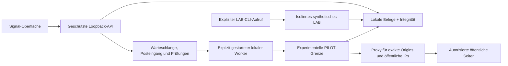

  

# Checkout Evidence Monitor

**Eine lokale Arbeitsoberfläche, um Veränderungen in einem konfigurierten Checkout-Ablauf nachzuvollziehen.**

[English](README.md) · [العربية](README.ar.md) · Deutsch

[Erste Schritte](docs/de/GETTING_STARTED.md) · [Dokumentation](docs/de/README.md) · [Versionshinweise](docs/releases/v0.2.0-alpha.1.md) · [Roadmap](docs/ROADMAP.md)

> **0.2.0 alpha — implementiert; Laufzeitprüfung ausstehend.** Statische Analyse, Typprüfung und Quellcode-Builds wurden erfolgreich durchgeführt. Die neue Überwachung, der PILOT-Kollektor und die Signal-Oberfläche sind noch nicht vollständig zur Laufzeit oder visuell geprüft. Ergebnisse aus v0.1.0 bestätigen diese Version nicht.

## Veränderungen verstehen, bevor du sie bewertest

CEM hilft autorisierten Shop-Betreibern, gespeicherte Beobachtungen zu vergleichen, Belege im Kontext des jeweiligen Ablaufs nachzuvollziehen und eine Prüfentscheidung zu dokumentieren. Ein separates synthetisches Labor unterstützt reproduzierbare Untersuchungen zur Beobachtungsabdeckung und Interpretation.

**Konfigurieren → beobachten → vergleichen → Belege prüfen → Entscheidung dokumentieren.**

Ein neues Skript ist nicht automatisch schädlich. Wo Belege fehlen, bleibt die Bewertung offen. Zuordnungen zu Standards liefern Kontext, aber weder ein Konformitätszertifikat noch ein Sicherheitsurteil.

## Enthaltene Funktionen

| Funktion | Was sich prüfen oder konfigurieren lässt |
|---|---|
| **Vier verbundene Ansichten** | Assessments, Journey, Changes und Evidence, angebunden an die lokale API |
| **Geführte Einrichtung** | Exakte öffentliche Origins, erlaubte Pfade, Selektoren sichtbarer Zustände, zeitlich begrenzte Autorisierung und Erfassungsintervall; neue Ziele werden pausiert gespeichert |
| **Vorsichtige Vergleichslogik** | Profile von Referenz- und Vergleichsdatensatz, Hashes von Antwortinhalten, beobachtete Header, Cookie-Attribute und ausdrücklich ausgewiesene Unsicherheit |
| **Lokale Überwachung** | Persistente Warteschlange, ein Worker, Pause/Abbruch, Wiederherstellung nach Unterbrechungen sowie Hinweise auf abgelaufene Autorisierungen und verpasste Zeitfenster |
| **Prüfablauf** | Meldungen ohne Duplikate im internen Posteingang, ausschließlich ergänzbare Prüfentscheidungen und bereinigter Prüfexport |
| **Forschungswerkzeuge** | Isoliertes synthetisches LAB, Vergleichsverfahren HTTP/PAGE/JOURNEY, versionierte Beispieldaten und vorab festgelegte Evaluationsprotokolle |

### Signal-Oberfläche

*Figma-Entwurf mit synthetischen Beispieldaten; kein Screenshot einer im Betrieb verifizierten Alpha-Version. Siehe [Designgalerie und Herkunft](docs/DESIGN.md). Die Anwendungsoberfläche ist derzeit englischsprachig. Einstieg und Einrichtung sind auf Deutsch, Englisch und Arabisch dokumentiert.*

## Das passende Profil wählen

| Profil | Zweck | Grenze |
|---|---|---|
| **OFFLINE** | Importierte oder eigens erstellte synthetische Datensätze prüfen | Keine Erfassung durch einen Browser |
| **LAB** | Kontrollierte Experimente reproduzieren | Mitgelieferte synthetische Beispieldaten in einem Container mit Netzwerkisolation |
| **PILOT — experimentell** | Ausdrücklich autorisierte öffentliche HTTPS-Seiten beobachten | Exakte Origins und Navigationspfade; neuer Gastkontext; isolierter Browser und Proxy mit Freigabeliste |

PILOT unterstützt GET/HEAD-Beobachtungen und erforderliche Selektoren sichtbarer Zustände. Es meldet sich nicht an, füllt keine Formulare aus, verändert keinen Warenkorb und führt weder Bestellungen noch Zahlungen aus. Der Einwilligungsstatus bleibt ungesetzt. Ein konfigurierter Ablauf kann erforderlich sein; viele reale Checkout-Abläufe liegen außerhalb dieses Profils.

## Erste Schritte

Benötigt werden **Python 3.12**, **Node 24** und Git. Docker ist für die Erfassung erforderlich, nicht für die OFFLINE-Prüfung. Die grundlegende Arbeitsoberfläche benötigt weder Shop-API noch Cloud-Konto, kostenpflichtigen Dienst oder LLM.

Die [Einrichtungsanleitung](docs/de/GETTING_STARTED.md) enthält vollständige Befehle für Windows und Linux, die Vorbereitung der Abhängigkeiten und den ausdrücklich freizugebenden OFFLINE-Demoablauf. Die Demo enthält gekennzeichnete synthetische Datensätze und startet keine Erfassung.

Lies vor der Verwendung eines bestehenden Datenspeichers die [Upgrade-Hinweise](docs/UPGRADING.md) auf Englisch.

- [Einrichtung unter Windows und Linux](docs/de/GETTING_STARTED.md)
- [Synthetisches LAB und CLI-Referenz — Englisch](docs/RUNBOOK.md)
- [PILOT-Konfiguration und Wiederherstellung — Englisch](docs/PILOT_QUICKSTART.md)
- [Autorisierung und Netzwerkgrenzen — Englisch](docs/PILOT_SECURITY.md)

## Architektur

Das synthetische LAB wird über den LAB-Wrapper der CLI gestartet; der Überwachungs-Worker verarbeitet PILOT-Aufträge. Beide Wege verwenden dasselbe Belegmodell. Die ausführlichen Grenzen stehen in der [Architekturbeschreibung](docs/ARCHITECTURE.md).

| Ebene | Technologie |
|---|---|
| Erfassung, Domänenmodell und API | Python 3.12, Playwright, FastAPI, Pydantic |
| Oberfläche | TypeScript, React, Vite, Tailwind, Radix/shadcn-Primitiven, Lucide |
| Lokale Speicherung | SQLite und bereinigte, unveränderliche Artefakte |
| Isolation der Erfassung | Linux-x64-Docker, Chromium-Sandbox und geprüfte Konfiguration der Ressourcen- und Netzwerkgrenzen |

Generierte Browser-Bundles und mitgelieferte Lizenztexte sind in `.gitattributes` gekennzeichnet, damit generierter Code die Sprachstatistik nicht verzerrt.

## Verifikation und ihre Grenzen

| Nachweis | 0.2.0 alpha |
|---|---|
| Ruff, TypeScript und geprüfte Frontend-/Paket-Builds | Erfolgreich; ausschließlich statische Prüfungen und Builds |
| Neue Laufzeit-, Oberflächen- und Isolationsprüfungen | Ausstehend |
| Aktuelle Shop-Kompatibilität oder Anwenderstudie | Nicht nachgewiesen |
| Frühere synthetische Benchmarks und lokale Tests | Nur historische Ergebnisse zu v0.1.0 |

Der [Verifikationsbericht](docs/TESTING_STATUS.md) hält Daten, Quellcode-Stände und Grenzen fest. Das [Evaluationsprotokoll](docs/EVALUATION_V1_1.md) trennt synthetische Reproduktion, PILOT-Kontrollen und die Interpretation durch Anwender. Produktionsreife, universelle Shop-Abdeckung, Genauigkeit bei der Erkennung von Schadsoftware oder eine Zertifizierung werden nicht behauptet.

## Dokumentation und Mitarbeit

Beginne mit dem [deutschen Dokumentationsindex](docs/de/README.md). [Issues](https://github.com/OmarBajamel/checkout-evidence-monitor/issues) und Beiträge sind auf Deutsch, Englisch oder Arabisch willkommen. Nenne Version, Profil und ein reproduzierbares synthetisches Beispiel. Lade niemals Kundendaten, Sitzungslinks oder Zugangsdaten hoch.

Lies die englischen Hinweise zu [Beiträgen](CONTRIBUTING.md), [Sicherheit](SECURITY.md) und der [Roadmap](docs/ROADMAP.md). CI wird ausschließlich manuell ausgelöst; ein veröffentlichter Commit startet keine Tests. Das Repository stellt Quellcode bereit, keinen gehosteten Dienst.

## Lizenz und Herkunft

Eigener Code und eigene Markengrafiken: [MIT](LICENSE). Von ASVS abgeleitete Materialien behalten ihre separate Quellenangabe und CC-BY-SA-4.0-Bedingungen. Abhängigkeiten und Designgrundlagen behalten ihre jeweiligen Lizenzen; siehe [NOTICE](NOTICE), [Drittanbieterhinweise](THIRD_PARTY_NOTICES.md) und [Quellenangaben](docs/ATTRIBUTION.md).

Ein Projekt von **Omar Ba Jamel**. Signal-Markengrafiken sind eigene Projektarbeiten; Lucide-Symbole und zugrunde liegende Komponenten sind separat ausgewiesen.
