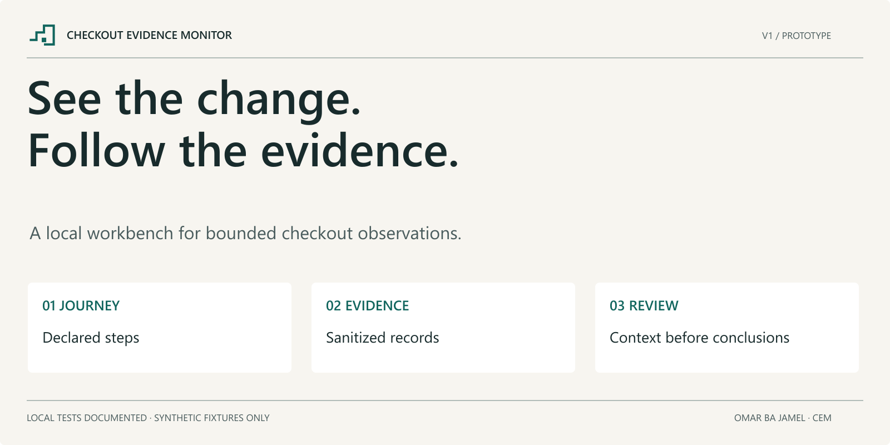
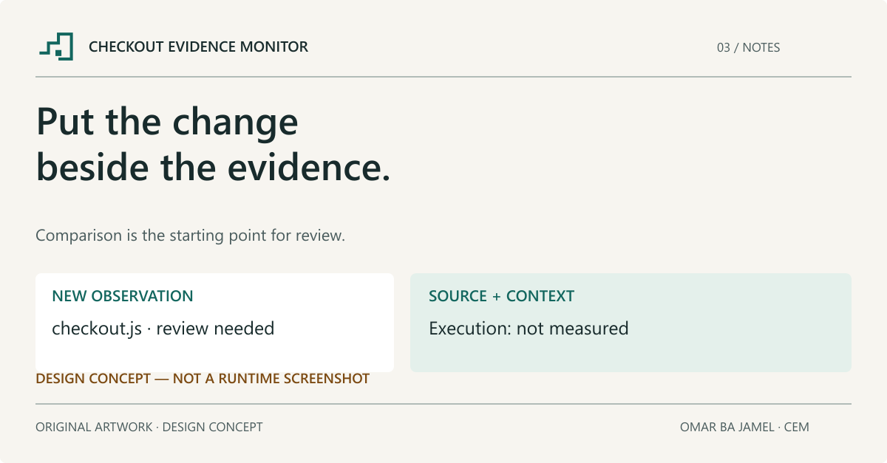
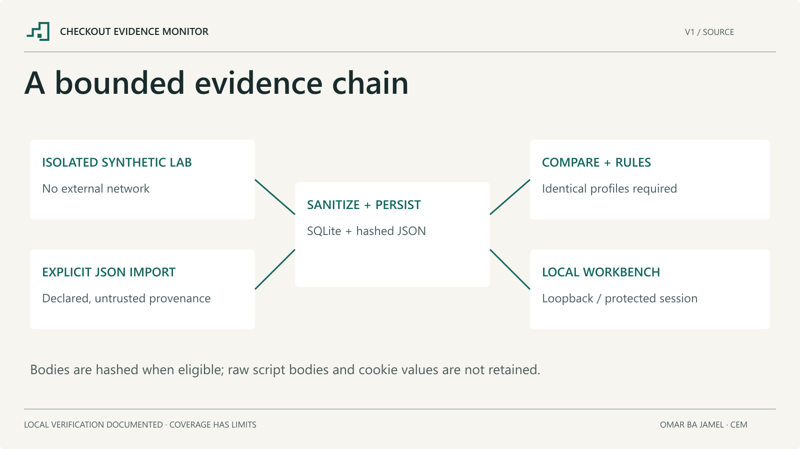

# Checkout Evidence Monitor



A local workbench for reviewing changes across configured checkout observations. Start with two comparable visits, inspect the evidence behind each difference, and keep missing evidence visible.

**Status: TESTED_PASS_LOCAL — 73 listed pytest cases passed and 153 synthetic benchmark attempts executed, including 21 partial observations.** Local checks do not establish production readiness or compliance. See the [verification record](docs/TESTING_STATUS.md) for exact counts, snapshots and limits.



## What V1 contains

- Explicit bounded JSON import and an isolated synthetic LAB collector. `AUTHORIZED_PUBLIC` is rejected before DNS or browser launch.
- Declarative catalog → cart → checkout steps, exact synthetic origins/actions, resource limits and cancellation handling.
- Same-session CDP script observations; hashes only for eligible completed bodies, with representation and unavailable reasons. Raw bodies and cookie values are not retained.
- SQLite persistence, sanitized-artifact integrity, reasoned baseline selection, profile-aware differences and twelve deterministic observation rules.
- Eight partial ASVS 5.0.0 relationships, PCI DSS manual context, offline HTML/JSON/CSV reports, and a protected loopback API.
- Four connected screens: Assessments, Journey, Changes and Evidence. Explicit synthetic demo mode is isolated and read-only.

A new script is not automatically malicious or unapproved. A request is not execution evidence. Standards relationships do not establish compliance, certification or an absence of vulnerabilities. A configured journey is required; this is not universal URL-only checkout coverage.

## Architecture



See [architecture](docs/ARCHITECTURE.md), [threat model](docs/THREAT_MODEL.md), [observation rules](docs/OBSERVATIONS.md) and [limitations](docs/LIMITATIONS.md).

## Install and build

The source targets CPython 3.12 (selected 3.12.14), Node 24 (selected 24.19.0), Windows for OFFLINE review, and Linux x64 with a compatible Docker engine for LAB. Windows OFFLINE package and UI checks are documented in the verification record. Linux x64 LAB ran successfully inside Docker Desktop 4.92.0 with engine 29.8.0/WSL2 on the recorded Windows host; other hosts remain unverified. Use a project-local environment and the appropriate binary hash lock. Follow [the runbook](docs/RUNBOOK.md) for exact setup, bootstrap, test permission and synthetic grant steps.

Windows static preparation:

```powershell
py -3.12 -m venv .venv
.venv/Scripts/python -m pip install --only-binary=:all: --require-hashes --no-compile -r requirements-dev-win.lock
cd frontend
npm ci --ignore-scripts --no-audit --no-fund
npm run typecheck
npm run build
cd ..
.venv/Scripts/python -m build --no-isolation
.venv/Scripts/python -m pip install --no-deps --no-compile dist/checkout_evidence_monitor-0.1.0-py3-none-any.whl
```

No script above starts the application or executes its tests. Browser installation/launch, Storybook and fixture execution are separate runtime actions. There are no automatic install or push test hooks.

## Explicit local use and evaluation

Every CLI entry point, including help, requires an explicit current local test-session record. It is an accidental-execution guard, not proof of human identity. After intentionally authorizing local execution, create a session as described in the runbook, then import a bounded sanitized record or issue a short-lived synthetic LAB grant. The shipped grant example is intentionally expired.

The UI is started explicitly with `cem ui`. It prints a one-use, 60-second bootstrap link to the local terminal and binds only to `127.0.0.1`. The bearer stays in page memory; no collection starts on load. `cem ui --demo` is an explicit authored synthetic example, not measured evidence or a fallback after failure.

The optional suite covers core scenarios T01–T24 and API/UI/publication cases T25–T38. Its [catalog](tests/TEST_CATALOG.json) and [evaluation protocol](docs/RESEARCH_DESIGN.md) and [measured synthetic results](docs/EVALUATION_RESULTS.md) include the executed local/LAB checks and the qualified synthetic evaluation. Remote CI uses manual dispatch only and requires separate explicit intent; nothing is dispatched automatically.

## Boundaries and attribution

Do not point V1 at a real merchant, payment provider, cloud metadata service or customer dataset. The LAB uses synthetic aliases inside a network-none container; keep Chromium sandboxing, exact-origin checks and TLS verification enabled. See [SECURITY.md](SECURITY.md).

Original code and artwork are MIT; ASVS-derived relationship data is CC-BY-SA-4.0. See [LICENSE](LICENSE), [NOTICE](NOTICE) and [third-party notices](THIRD_PARTY_NOTICES.md). Development used Codex assistance. Author: Omar Ba Jamel. This repository is a technical prototype, not an assessment service or a published academic result.
