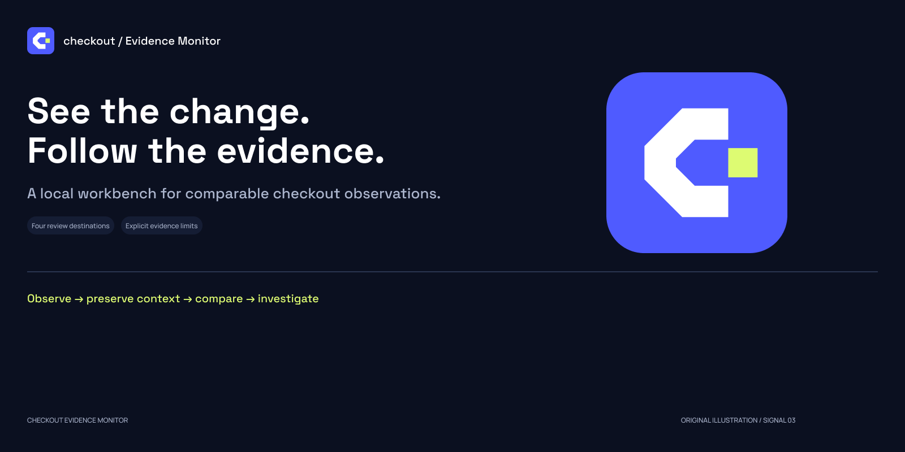
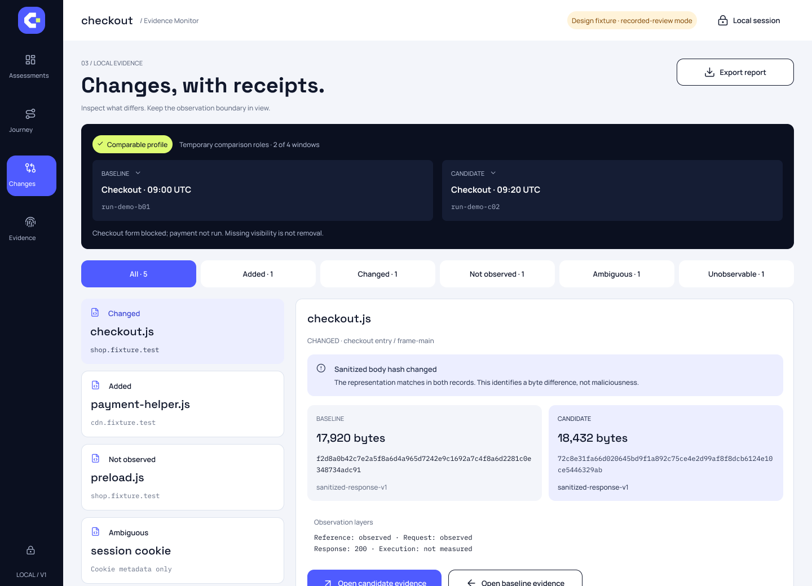
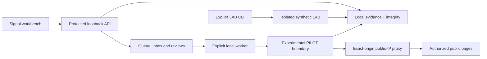

  

# Checkout Evidence Monitor

**A local workbench for understanding what changed in a configured checkout journey.**

English · [العربية](README.ar.md)

[Get started](docs/GETTING_STARTED.md) · [Documentation](docs/README.md) · [Release notes](docs/releases/v0.2.0-alpha.0.md) · [Roadmap](docs/ROADMAP.md)

> **0.2.0 alpha — implemented; runtime verification pending.** Static analysis, type checking and source builds have passed. The new monitoring, PILOT collector and Signal interface have not yet completed runtime or visual verification. Earlier v0.1.0 results do not validate this version.

## Understand a change before deciding what it means

CEM helps an authorized store operator compare recorded observations, follow the evidence to its journey context, and document a review decision. A separate synthetic lab supports reproducible research into observation coverage and interpretation.

**Configure → observe → compare → inspect → record a decision.**

A new script is not automatically malicious. Missing evidence remains unknown. Standards mappings provide context, not a compliance certificate or security verdict.

## What is included

| Capability | What you can inspect or configure |
|---|---|
| **Four connected views** | Assessments, Journey, Changes and Evidence, using the local evidence API |
| **Guided setup** | Exact public origins, permitted paths, visible-state selectors, time-bounded authorization and cadence; saved paused |
| **Conservative comparison** | Baseline/candidate profiles, response-body hashes, observed headers, cookie attributes and explicit uncertainty |
| **Local monitoring** | Durable queue, one worker, pause/cancel, interrupted-run recovery, expired grants and missed-window notices |
| **Review workflow** | Deduplicated in-app inbox, append-only decisions and sanitized review export |
| **Research tools** | Isolated synthetic LAB, HTTP/PAGE/JOURNEY arms, versioned fixtures and prespecified evaluation protocols |

### Signal interface

*Figma design concept with synthetic values. This is not a screenshot of a verified running alpha. See the [design gallery and provenance](docs/DESIGN.md). The application interface is currently English; documentation is available in English and Arabic.*

## Choose the right profile

| Profile | Purpose | Boundary |
|---|---|---|
| **OFFLINE** | Review imported or authored synthetic records | No browser collection |
| **LAB** | Reproduce controlled experiments | Shipped synthetic fixtures inside a network-isolated container |
| **PILOT — experimental** | Observe specifically authorized public HTTPS pages | Exact origins and navigation paths; fresh guest context; isolated browser and allowlisted proxy |

PILOT accepts GET/HEAD observations and required visible selectors. It does not sign in, fill forms, mutate a cart, create orders or complete payment. Consent remains unset. A configured journey may be necessary, and many real checkout flows are outside this profile.

## Get started

Use **Python 3.12**, **Node 24** and Git. Docker is needed for collection, not for OFFLINE review. No merchant API, cloud account, paid service or LLM is required for the core workbench.

The [setup guide](docs/GETTING_STARTED.md) includes complete Windows and Linux commands, dependency preparation and an explicit OFFLINE demo workflow. The demo contains labelled synthetic records and starts no collection.

For existing users, read the [upgrade notes](docs/UPGRADING.md) before opening an existing evidence store with the alpha.

- [Windows and Linux setup](docs/GETTING_STARTED.md)
- [Synthetic LAB and CLI reference](docs/RUNBOOK.md)
- [Pilot configuration and recovery](docs/PILOT_QUICKSTART.md)
- [Authorization and network boundary](docs/PILOT_SECURITY.md)

## Architecture

The synthetic LAB is launched through the CLI's LAB wrapper; the monitoring worker dispatches PILOT jobs. Both paths share the evidence model. See [architecture](docs/ARCHITECTURE.md) for the detailed boundaries.

| Layer | Technology |
|---|---|
| Collector, domain and API | Python 3.12, Playwright, FastAPI, Pydantic |
| Interface | TypeScript, React, Vite, Tailwind, Radix/shadcn primitives, Lucide |
| Local persistence | SQLite plus sanitized immutable artifacts |
| Collector isolation | Linux x64 Docker, Chromium sandbox, inspected resource/network controls |

Generated browser bundles and vendored license material are identified in `.gitattributes`; source languages remain visible without generated-code inflation.

## Verification, with its limits

| Evidence | 0.2.0 alpha |
|---|---|
| Ruff, TypeScript and audited frontend/package builds | Passed; static/build checks only |
| New runtime, UI and isolation checks | Pending |
| Current merchant compatibility or operator study | Not established |
| Prior synthetic benchmark and local tests | Historical v0.1.0 evidence only |

The [verification record](docs/TESTING_STATUS.md) preserves dates, snapshots and limits. The [evaluation protocol](docs/EVALUATION_V1_1.md) separates synthetic reproduction, pilot controls and operator interpretation. No production readiness, universal store coverage, malware-detection accuracy or standards certification is claimed.

## Documentation and participation

Start with the [documentation index](docs/README.md). [Issues](https://github.com/OmarBajamel/checkout-evidence-monitor/issues) and contributions are welcome in English or Arabic. Include the version, profile and reproducible synthetic example; never upload customer data, session links or credentials.

Read [Contributing](CONTRIBUTING.md), the [security policy](SECURITY.md) and the [roadmap](docs/ROADMAP.md). CI is manual opt-in; publishing a commit does not dispatch tests. This repository is source distribution, not a hosted application.

## License and attribution

Original code and artwork: [MIT](LICENSE). ASVS-derived materials retain their separate attribution and CC-BY-SA-4.0 terms. Dependencies and design foundations retain their own licenses; see [NOTICE](NOTICE), [third-party notices](THIRD_PARTY_NOTICES.md) and [attribution](docs/ATTRIBUTION.md).

Created by **Omar Ba Jamel**, with Codex assistance. Signal artwork is original project work; Lucide icons and upstream component foundations are credited separately.
