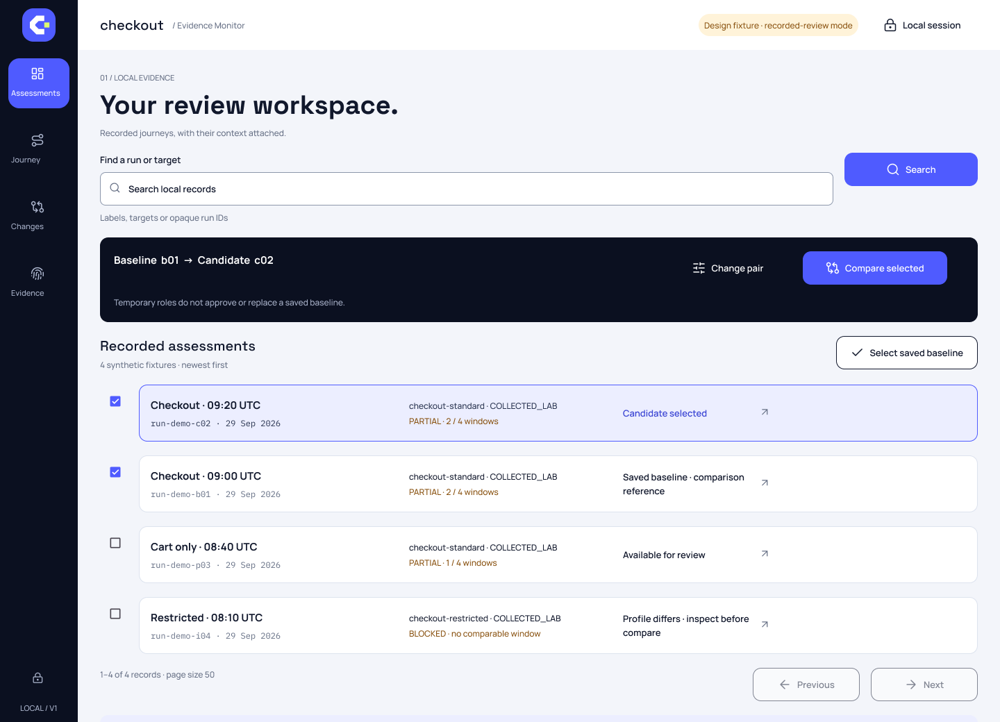

# Signal design and visual provenance

[Documentation](README.md)

Signal 03 uses a night navigation rail, bright blue actions, lime emphasis, generous spacing and an original open-aperture mark. Evidence, comparison context and uncertainty take precedence over scorecards.

The images below are **Figma design concepts with synthetic fixtures**, exported on September 29, 2026. They show the approved visual direction; they do not establish runtime fidelity, accessibility or the behavior of the new monitoring flows.

| Concept | Image |
|---|---|
| Assessments — recorded visits and comparison pair | [View concept](../assets/signal/assessments-concept.png) |
| Changes — before/after evidence | [View concept](../assets/signal/changes-concept.png) |

## Assets and implementation

- [Signal asset guide](../assets/signal/README.md) and [asset checksums](../assets/signal/manifest.json).
- [Application mapping](SIGNAL_IMPLEMENTATION.md): React screens, native controls and responsive styles.
- [Accessibility status](ACCESSIBILITY.md): intended behavior and checks still required.
- The original mark and editorial artwork are project-authored. Lucide icons and Material 3 Figma component foundations retain their own provenance; the upstream UI kit is not redistributed.
- Typeface names are CSS preferences with system fallbacks. No installed font software is bundled and no external font request is required.
- Earlier artwork under assets/brand, assets/readme and assets/concepts is historical v0.1 material. It is retained for history and must not be used to imply the alpha has passed runtime verification.

See [third-party notices](../THIRD_PARTY_NOTICES.md).
